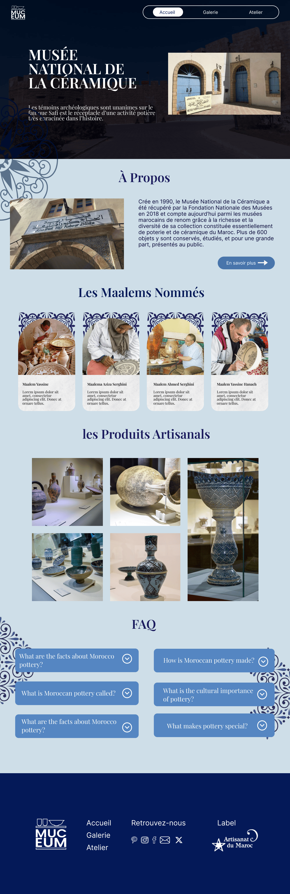
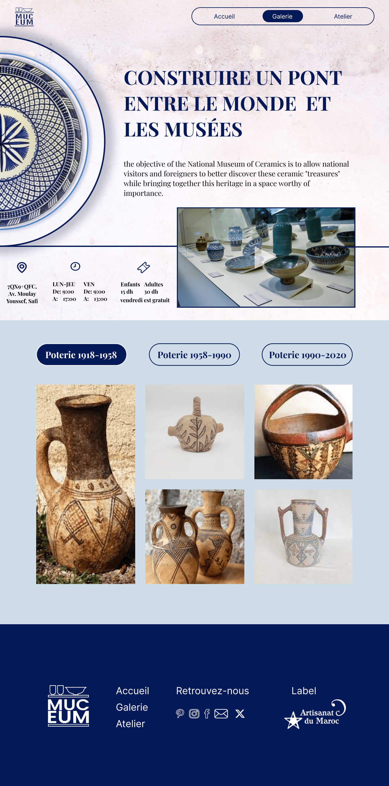
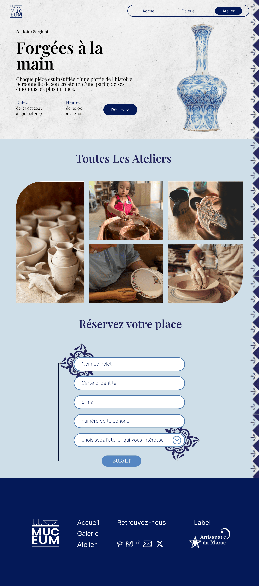

# MUCEM

A website to highlight the new Pottery Museum, called "MUCEM".

## Figma Design

### Mockups

   !

## Figma link

- [Figma Link](https://www.figma.com/file/UJb4zL0eV065xwaaYmZmNh/MUCEUM?type=design&node-id=0%3A1&mode=design&t=QXP7MtiqCUpL13jH-1)

## Demo

https://ayaelrhayour.github.io/MUCEM/

## Presentation

- [Presentation Link](https://www.canva.com/design/DAFySvL4TFY/T3UKILDxEnyhfj38haM_9Q/edit?ui=eyJHIjp7fX0)

## Trello

- [Trello Link](https://trello.com/b/9pWhGK1N/muceum)

## Tech Stack

_Client:_ HTML, CSS, js

## Author

- [Aya Elrhayour](https://github.com/AyaElrhayour)

## Feedback

For any feedback or inquiries, please don't hesitate to contact me at ayaelrhayour123@gmail.com. Your input is greatly appreciated!
